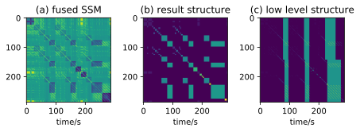
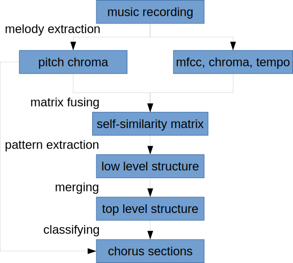

# Chorus Detection Using Music Structure Analysis

This repo implements a chorus detection algorithm. The algorithm detects chorus sections in pop music, and the output follows the [MIREX (*Music Information Retrieval Evaluation eXchange*) Structural Segmentation](https://www.music-ir.org/mirex/wiki/2017:Structural_Segmentation) format. A structural view of the detected choruses can be seen in the figure below, where the green stripes in subfigure "c" show the ground-truth and output chorus sections.



The code also evaluated some other algorithms:

- [pop-music-highlighter](https://github.com/remyhuang/pop-music-highlighter)

- 5 algorithms in [msaf](https://github.com/urinieto/msaf)

## Prerequisite

The algorithm was implemented in `Python 3.7`, the requirements were listed in `requirements.txt`, install them using:

```bash
pip install -r ./requirements.txt
```

~~The **latest** version of `librosa` which has some crucial fixes should be installed via Github:~~

```bash
git clone --depth=1 https://github.com/librosa/librosa.git
pip install -e librosa
```

Download the melody extraction algorithm [JDC](https://github.com/keums/melodyExtraction_JDC), and configure the path as described in *Configuration*:

```bash
git clone --depth=1 https://github.com/keums/melodyExtraction_JDC.git
```

## Configuration

A few paths need to be set in `configs/configs.py`:

- the code depends on the algorithm [JDC](https://github.com/keums/melodyExtraction_JDC) mentioned above, edit the value `ALGO_BASE_DIRS['JDC']` so that it points to the location of the downloaded repo.

- the preprocessed data were stored in `DATASET_BASE_DIRS['LocalTemporary_Dataset']`, change it to anywhere you want to store the large files.

If you are only interested in using the algorithm, you can skip the following lines.

If you want to evaluate the algorithms, more configurations need to be done:

- the code evaluates the algorithms on the [RWC Pop dataset](https://archives.ismir.net/ismir2002/paper/000049.pdf), if you have the dataset and want to evaluate on it, edit the value `DATASET_BASE_DIRS['RWC']` so that it points to the location of the dataset, and ensure the directory structure is as listed below:

    ```bash
    .
    └── RWC-MDB-P-2001
       ├── AIST.RWC-MDB-P-2001.CHORUS
       ├── RWC研究用音楽データベース
       ├── RWC研究用音楽データベース Disc 2
       ├── RWC研究用音楽データベース Disc 3
       ├── RWC研究用音楽データベース Disc 4
       ├── RWC研究用音楽データベース Disc 5
       ├── RWC研究用音楽データベース Disc 6
       └── RWC研究用音楽データベース Disc 7
    ```

- for evaluation of the algorithms implemented by [msaf](https://github.com/urinieto/msaf) python package, comment out the line 335 `file_struct.features_file = msaf.config.features_tmp_file` in `.../lib/python3.7/site-packages/msaf/run.py` and `mkdir features` in the dataset folder for faster performance using feature cache instead of single temporary feature file.

- for evaluation of the [pop-music-highlighter](https://github.com/remyhuang/pop-music-highlighter), since the python version is not compatible with that of the highlighter, you need to get its result in advance and set the value of `ALGO_BASE_DIRS['PopMusicHighlighter']` so that it points to the location containing the results as `<originalAudioFileName>_highlight.npy` files.

## Usage

To detect the chorus sections of a music recording, use the `predict.py`:

```bash
Usage: predict.py [OPTIONS] [AUDIOFILES]...

Options:
  --outputdir PATH
  --metaOutputdir PATH
  --algo [multi|single]
  --force BOOLEAN
  --help                 Show this message and exit.
```

A Quick example is

```bash
python predict.py ./data/example/starfall.mp3
```

By default, the algorithm outputs all the chorus sections detected, but you can use the option `--algo single` to force it outputs a single chorus section.

The default directory for mirex format output (OUTPUTDIR) is `./data/predict`, the output file contains 3 columns:

```
<onset_time(sec)>\t<offset_time(sec)>\t<label>\n
<onset_time(sec)>\t<offset_time(sec)>\t<label>\n
...
```

The default directory for viewer metadata (METAOUTPUTDIR) is `./data/viewerMetadata`, the JSON files were used for a simple HTML player which shows the result of chorus detection. To view the output and play the music, use the simple HTML [page](viewer/index.html) `./viewer/index.html` to open the metadata file.

The metadata generated by the algorithm always links to a local audio file. For a quick example, however, you can open the [file](data/example/starfall_meta.json) `data/example/starfall_meta.json` which has an online audio link in the viewer:


To evaluate the algorithms, calculate the features for audio files first, and train the classifier, then evaluate:
```bash
python feature.py build && python feature.py train && python eval_algos.py
```

## Custom dataset

Besides the dataset [RWC Pop](https://staff.aist.go.jp/m.goto/RWC-MDB/AIST-Annotation/) and [SALAMI](http://ismir2011.ismir.net/papers/PS4-14.pdf) provided in the code, you can add your own dataset for training and testing. For this purpose, you should add a custom dataset class in `utility/dataset.py` which would be a subclass of `BaseStructDataset`. The audio files and annotations should be set in the class variable `self.pathPairs`  on initialization, whose type is a list of namedtuple `StructDataPathPair`. Then you need to implement the `loadGT` method in the custom class, `loadGT` accepts the path of the annotation file, and returns a [MIREX](https://www.music-ir.org/mirex/wiki/2017:Structural_Segmentation) format data, which is composed of segments' onset/offset times and its label. You can also optionally implement the method `semanticLabelDic` which accepts nothing and returns a dictionary that maps the label used in your dataset to specific numbers, it's used for generating labeled target Self-similarity Matrix, but this functionality was not used currently. However, the labels used for training is generated using a string-match method, all the labels from the dataset start with the substring "chorus" is considered as the target segments.

## How it works

The overview of the algorithm is described in the image below. Firstly, acoustic features as pitch chroma, MFCC, chroma, and tempogram were calculated from the input music recording. Then self-similarity matrices were generated on these features and fused into one. Low-level patterns were extracted by graph algorithms assuming transitivity of similarity and merged to form top-level structures. In the end, a classifier learns from the training data to detect chorus sections and makes predictions on structural information and melody features of the input sections.


